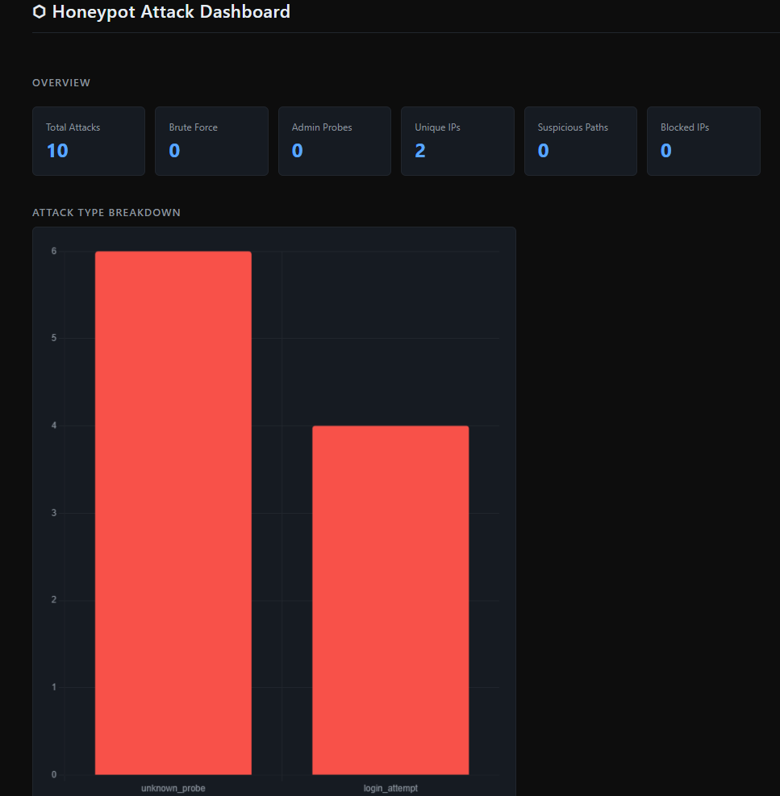
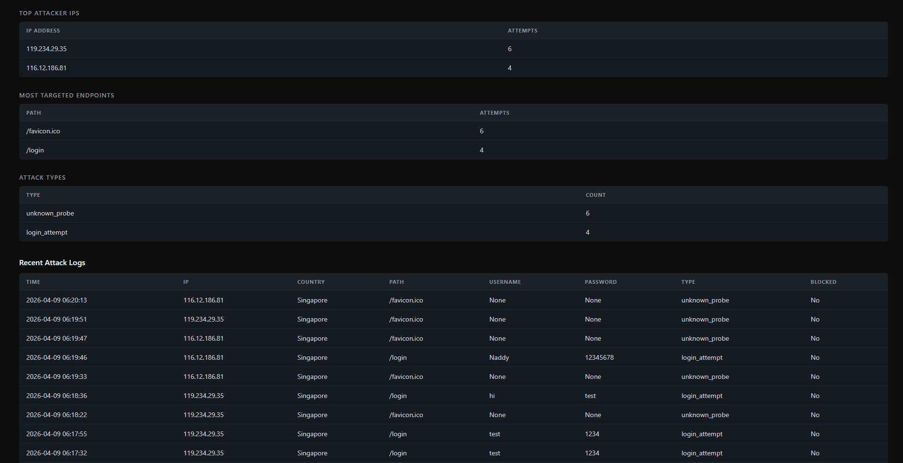
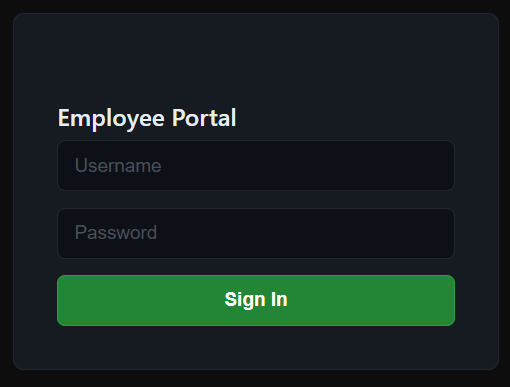
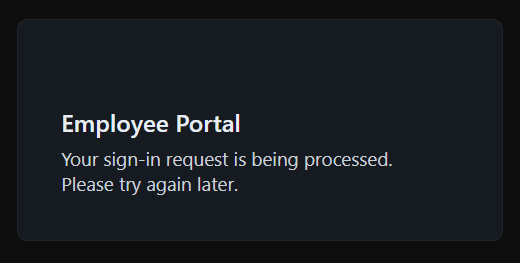
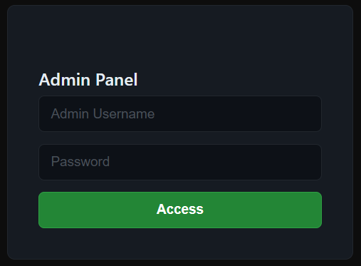
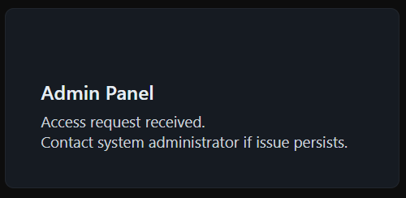

# 🍯 Cloud Honeypot with Attack Dashboard

A simulated vulnerable web server deployed on AWS EC2 that captures and logs real attack attempts in real time. Built to study attacker behavior — not to protect a system, but to **attract and observe** one.

> ⚡ Live Demo: [http://18.188.119.182/dashboard](http://18.188.119.182/dashboard)

---

## 📸 Screenshots

### Attack Dashboard


### Attack Logs


### Fake Login Page


### Login Response (fools the attacker)


### Fake Admin Panel


### Admin Response


---

## 🔍 What It Does

- Exposes fake `/login` and `/admin` pages to attract real attackers
- Logs every request: IP address, country, credentials entered, user agent, path, and attack type
- Automatically detects **brute force attempts**, **admin probes**, and **suspicious path scans**
- Enriches every IP with country data using MaxMind GeoLite2
- Displays everything live on a dark-themed dashboard with Chart.js visualizations

---

## 🛠 Tech Stack

| Layer       | Technology                        |
|-------------|-----------------------------------|
| Backend     | Python, Flask                     |
| Database    | MySQL 8                           |
| Frontend    | HTML, CSS, Chart.js               |
| Proxy       | Nginx                             |
| Infra       | Docker, docker-compose, AWS EC2   |
| GeoIP       | MaxMind GeoLite2                  |

---

## 🚀 Quick Start

**Prerequisites:** Docker and docker-compose installed.

```bash
git clone https://github.com/zeekvy/cloud-honeypot.git
cd cloud-honeypot
docker compose up --build
```

Then open:

| URL | Description |
|-----|-------------|
| `http://localhost/` | Honeypot home page |
| `http://localhost/login` | Fake login page |
| `http://localhost/admin` | Fake admin panel |
| `http://localhost/dashboard` | Attack dashboard |

---

## 🗂 Project Structure

```
cloud-honeypot/
├── app.py                    # Flask routes and request handling
├── config.py                 # Database config via environment variables
├── db.py                     # MySQL connection
├── geo_lookup.py             # IP → country via MaxMind GeoLite2
├── utils/
│   └── detector.py           # Attack classification logic
├── templates/
│   ├── dashboard.html        # Live attack dashboard
│   ├── login.html            # Fake employee login page
│   ├── admin.html            # Fake admin panel
│   └── nginx/
│       └── default.conf      # Nginx reverse proxy config
├── static/
│   └── style.css             # Dark minimalist theme
├── geoip/
│   └── GeoLite2-Country.mmdb # MaxMind GeoIP database
├── schema.sql                # Database schema
├── Dockerfile                # Flask app container
├── docker-compose.yml        # Full stack orchestration
└── requirements.txt
```

---

## 🧠 Attack Detection Logic

| Attack Type       | Trigger                                          |
|-------------------|--------------------------------------------------|
| `login_attempt`   | Any POST to `/login`                             |
| `brute_force`     | 5+ login attempts from same IP within 5 minutes  |
| `admin_probe`     | Any access to `/admin`                           |
| `suspicious_path` | Paths like `.env`, `wp-login.php`, `.git`        |
| `unknown_probe`   | Any other unrecognized path                      |

---

## ☁️ Deployment (AWS EC2)

This project is deployed on an AWS EC2 t2.micro instance (Ubuntu 24.04) running Docker.

```bash
# On the EC2 instance:
git clone https://github.com/zeekvy/cloud-honeypot.git
cd cloud-honeypot
docker-compose up --build -d
```

Nginx listens on port 80 and proxies traffic to the Flask app container.

---

## 📋 Local Development (without Docker)

```bash
python -m venv .venv
source .venv/bin/activate        # Windows: .venv\Scripts\activate
pip install -r requirements.txt
cp .env.example .env             # Fill in your DB credentials
mysql -u root -p < schema.sql    # Set up the database
python app.py
```